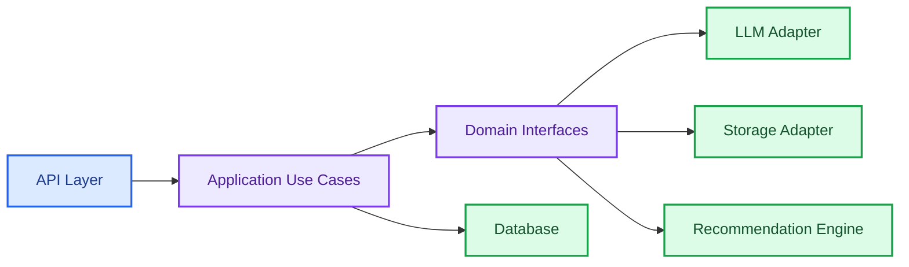

# LuminaLib

<p align="center">
  
  
  
  
</p>

LuminaLib is a FastAPI-based book and review platform with clean architecture boundaries for authentication, books, reviews, recommendation use cases, LLM integration, and storage abstractions.

## What It Demonstrates

- FastAPI API modules for auth, books, reviews, and recommendations.
- Application use cases such as ingesting books, analyzing reviews, and recommending books.
- Domain interfaces for LLMs, recommenders, and storage.
- Infrastructure adapters for local storage, S3-style storage, mock LLMs, and Ollama.
- SQLAlchemy, Alembic, and async Postgres-ready dependencies.
- Docker and Docker Compose deployment setup.

## Architecture



## Repository Map

```text
app/api/                  HTTP endpoints
app/application/use_cases/ Business workflows
app/domain/               Models and interfaces
app/infrastructure/       LLM and storage adapters
app/core/                 Config, database, security, dependencies
Dockerfile                Container entry point
docker-compose.yml        Local service composition
requirements.txt          Runtime dependencies
```

## Run Locally

```powershell
python -m venv .venv
.\.venv\Scripts\Activate.ps1
pip install -r requirements.txt
uvicorn app.main:app --reload
```

With Docker:

```powershell
docker compose up --build
```

## Revision Notes

- Clean architecture works well when domain logic should not depend on infrastructure.
- Interfaces make it easy to swap mock LLMs, Ollama, local storage, or S3 storage.
- Recommendation systems benefit from clear separation between ingestion, analysis, and serving.

## Interview Talking Points

```text
The strongest design choice here is the separation between API, application use cases,
domain interfaces, and infrastructure adapters. That keeps the book recommendation and
review analysis logic testable while allowing LLM and storage providers to change later.
```
